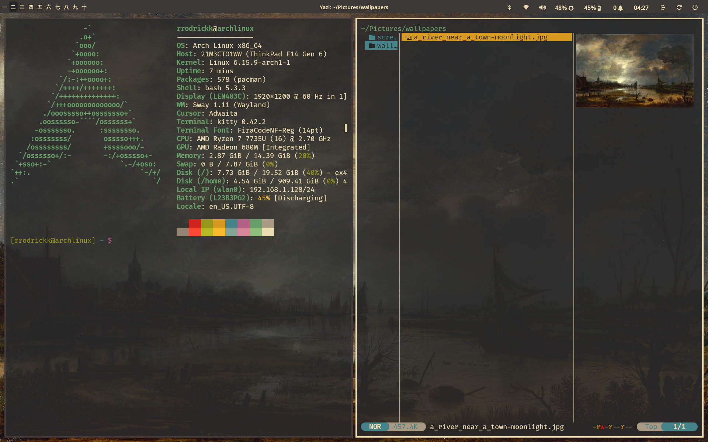

  

# 🛠️ dotfiles

My handpicked **[Arch Linux + Sway]** Window Manager Environment — minimal, keyboard-driven, and built for productivity.

---

## 🎹 Mod Key
`$mod = Mod4` → Usually the **Super / Windows** key

---

## 🖥️ Launch Apps

| Keybind              | Action                               |
|----------------------|--------------------------------------|
| `Ctrl + Alt + T`     | Launch terminal (`kitty`)            |
| `$mod + Space`       | Launch app menu (`wofi --show drun`) |
| `$mod + L`           | Lock screen                          |
| `$mod + Shift + C`   | Reload Sway config                   |
| `$mod + Shift + Q`   | Exit Sway (via `swaynag`)            |
| `$mod + Esc`         | Restart Waybar                       |

---

## 🚀 Workspace Management

### Switch to Workspace

| Keybind        | Action               |
|----------------|----------------------|
| `$mod + 1..0`  | Go to workspace 1–10 |

### Move Window to Workspace

| Keybind              | Action                          |
|----------------------|---------------------------------|
| `$mod + Shift + 1..0`| Move focused window to workspace |

---

## 📦 Window Focus & Movement

| Keybind                 | Action              |
|-------------------------|---------------------|
| `$mod + Arrow Keys`     | Move focus          |
| `$mod + Shift + Arrows` | Move window         |
| `$mod + A`              | Focus parent        |

---

## 🪟 Window Layout

| Keybind             | Action             |
|---------------------|--------------------|
| `$mod + S`          | Stacking layout    |
| `$mod + W`          | Tabbed layout      |
| `$mod + E`          | Toggle split       |
| `$mod + F`          | Toggle fullscreen  |
| `$mod + Shift + Space` | Toggle floating |
| `$mod + Shift + -`  | Send to scratchpad |
| `$mod + -`          | Show scratchpad    |

---

## ↔️ Resize Mode

- Enter resize mode: `$mod + R`

| Key            | Action                |
|----------------|------------------------|
| Arrow Keys     | Shrink/Grow container  |
| Return / Esc   | Exit resize mode       |

---

## 🔊 Volume & 🔆 Brightness

| Key                    | Action            |
|------------------------|-------------------|
| XF86AudioRaiseVolume   | Volume +5%        |
| XF86AudioLowerVolume   | Volume -5%        |
| XF86AudioMute          | Toggle mute       |
| XF86AudioMicMute       | Toggle mic mute   |
| XF86MonBrightnessUp    | Brightness +5%    |
| XF86MonBrightnessDown  | Brightness -5%    |

---

## 🧰 Utilities

| Keybind           | Action                                  |
|-------------------|------------------------------------------|
| `$mod + Shift + S`| Area Screenshot (custom script)         |
| `$mod + V`        | Clipboard history via `wofi` + `cliphist`|

---

## 🖥️ Display & Wallpaper

- Output: `eDP-1` @ 1920x1200  
- Wallpaper: `~/Pictures/wallpapers/a_river_near_a_town-moonlight.jpg`  
- Adaptive Sync: `Off`

---

## 💤 Idle Behavior

- Lock after **5 minutes**  
- Turn off display after **10 minutes**  
- Lock before sleep ✅

---

## 🖱️ Input Settings

### Touchpad  
✅ Tap-to-click  
✅ Natural Scroll  
✅ Middle Emulation  

### Keyboard  
- Layout: `pt`

---

## 🎨 UI Theme

- Font: `Fira Code Nerd Fonts Bold 18`
- Borders: `4px`
- Gaps: `inner 7px`, `outer 5px`

### Colors

| Element            | Hex Code   |
|--------------------|------------|
| Background         | `#3c3836`  |
| Text / Focus       | `#ebdbb2`  |
| Unfocused Window   | `#453a3a`  |

---

## 📊 Waybar Configuration Overview

- **Layer**: `top`
- **Height**: `20px`
- **Spacing**: `5px`

### 🔹 Modules

| Section       | Modules |
|---------------|---------|
| `modules-left` | `sway/workspaces` |
| `modules-center` | `sway/window` |
| `modules-right` | `tray`, `bluetooth`, `network`, `pulseaudio`, `backlight`, `battery`, `custom/notification`, `clock`, `custom/logout`, `custom/reboot`, `custom/poweroff` |

### 🔧 Highlights

- `sway/workspaces` shows numbers with Unicode icons
- `bluetooth` (starts off): controlled by `blueman-manager`
- `network` opens `nmtui` in `kitty`
- `pulseaudio`: scroll to change volume, click to mute
- `custom/logout`, `custom/reboot`, `custom/poweroff` show `swaynag` confirmation prompts
- `notification`: integrates with `swaync-client`

---

## 🚀 Autostart Apps

- `waybar`
- `xwayland`
- `thinkpadbacklight.service`
- `gammastep -O 3200`
- `pulseaudio`
- `cliphist` (text & image support)

---

## ✅ Tips & Resources

- Run `swaymsg -t get_outputs` to list monitor names
- Read:
  - `man 5 sway`
  - `sway-input`
  - `sway-bar`
- Customize Waybar, Wofi, and styles with **CSS**
- Use `swaync-client`, `cliphist`, `wl-paste`, and `grimshot` for richer desktop tooling

---

> ⚙️ Want more? Star this repo, fork it, or submit PRs with your improvements!

